# ⚡ PREPIQ — Autonomous Multi-Agent Interview Intelligence & ATS Architect

<div align="center">

[](https://mistral.ai)
[](https://nodejs.org)
[](https://react.dev)
[](https://mongodb.com)
[](https://pptr.dev)
[](LICENSE)

<p align="center">
  <strong>An autonomous multi-agent AI system that inspects target job requirements, gathers live company engineering context via tool-calling, calculates competitive readiness deltas, and compiles ATS-tailored resumes.</strong>
</p>

</div>

---

## 💡 About The Project

Most interview preparation apps are simple single-prompt wrappers. **PREPIQ** is engineered as a **collaborative multi-agent collective** with **real-time tool calling**, strict structured schema enforcement, and headless browser compilation.

When a user drops their resume and target job description:
1. An **Agentic Context Harvester** detects the hiring company and executes live API tool calls (e.g. Wikipedia REST endpoints) to map company engineering culture, values, and tech stack.
2. An **Assessment & Gap Synthesizer** cross-evaluates candidate skills against role requirements to construct a quantified Fit Score and role-tailored behavioral/technical drills.
3. An **ATS Architect Agent** generates semantic, single-column HTML resume markup and compiles it into a downloadable PDF via **Puppeteer**.

---

## 🏛️ System Architecture

```mermaid
sequenceDiagram
    autonumber
    actor Candidate as 👤 Candidate
    participant Gateway as 🌐 Express API Gateway
    participant Agent1 as 🕵️ Agent 1: Context Harvester
    participant WikiTool as 🛠️ Tool: fetchCompanyWiki()
    participant Agent2 as 🧠 Agent 2: Report Synthesizer
    participant Agent3 as 📄 Agent 3: ATS Architect (Puppeteer)
    participant Database as 🗄️ MongoDB Atlas

    Candidate->>Gateway: POST /api/interview (Resume PDF + Job Description)
    Gateway->>Agent1: Trigger Multi-Agent Pipeline
    
    rect rgb(20, 15, 35)
        Note over Agent1,WikiTool: Phase 1: Autonomous Tool Calling
        Agent1->>Agent1: Parse JD & extract hiring entity (e.g., "Stripe")
        Agent1->>WikiTool: Execute tool_call: fetchCompanyWiki("Stripe")
        WikiTool-->>Agent1: Return company history, architecture & values
    end

    rect rgb(15, 25, 35)
        Note over Agent2: Phase 2: Multi-Vector Synthesis
        Agent1->>Agent2: Forward (Candidate Resume + JD + Live Context)
        Agent2->>Agent2: Evaluate Skill Gaps, Fit Score, Technical & Behavioral Drills
    end

    rect rgb(25, 20, 30)
        Note over Agent3: Phase 3: ATS Compilation
        Agent2->>Agent3: Generate Semantic HTML Resume Schema
        Agent3->>Agent3: Launch Headless Chrome & Compile ATS PDF Buffer
    end

    Agent3->>Database: Persist Interview Session & Telemetry
    Database-->>Gateway: Session ID Created
    Gateway-->>Candidate: 201 Created (JSON Report + PDF Access)
```



---

## ✨ Core Features

### 1. 🤖 Multi-Agent Orchestration Pipeline
* **Context Gatherer Agent**: Analyzes the job description to find company entities and calls external data tools.
* **Report Synthesizer Agent**: Uses `mistral-large-latest` with strict JSON schemas (`responseFormat: { type: "json_object" }`) to produce scorecards, skill gap breakdowns, and prioritized study roadmaps.
* **ATS Architect Agent**: Converts tailored application data into a single-column semantic ATS resume.

### 2. 🛠️ Autonomous Tool Calling (RAG-lite)
* Uses native Mistral Tool Calling (`tools` parameter) to call `fetchCompanyWiki`.
* Enriches the LLM context dynamically with real-world company background without needing massive vector embeddings for public company data.

### 3. 📄 Automated Headless Chrome PDF Compilation
* Uses **Puppeteer** to render the generated HTML resume in a headless Chromium environment, producing vector-sharp, printer-friendly PDFs with 100% ATS readability.

### 4. 🎨 Awwwards-Inspired Dark Editorial UI
* **Luxury Typography**: **Clash Display** (bold geometric display headlines) paired with **Instrument Serif** (editorial italic emphasis), **Plus Jakarta Sans** (body text), and **Space Grotesk / JetBrains Mono** (metrics & telemetry).
* **Cinematic SVG Filters**: Integrated `#grain-filter` (fractal turbulence) and liquid displacement maps.
* **Interactive 60fps Physics Canvas**: Neural particle constellation that reacts to cursor proximity and parallax motion.

### 5. 🔐 Dual Authentication Architecture
* **Standard Auth**: Secure password hashing with `bcryptjs` and HTTP-only JWT cookies.
* **OAuth 2.0**: Integrated **Google OAuth 2.0** with `Passport.js` strategy for 1-click authentication.

---

## 🗂️ Project Structure

```text
InterviewPrepApp/
├── Backend/
│   ├── src/
│   │   ├── config/
│   │   │   ├── db.js              # MongoDB Atlas connection
│   │   │   └── passport.config.js # Google OAuth 2.0 Strategy
│   │   ├── controllers/
│   │   │   ├── auth.controller.js
│   │   │   └── interview.controller.js
│   │   ├── middlewares/
│   │   │   ├── auth.middleware.js
│   │   │   └── multer.middleware.js
│   │   ├── models/
│   │   │   ├── user.model.js
│   │   │   └── interview.model.js
│   │   ├── routes/
│   │   │   ├── auth.routes.js     # /api/auth (Login, Register, Google OAuth)
│   │   │   └── interview.route.js  # /api/interview (Analyze, Reports, PDF)
│   │   ├── services/
│   │   │   ├── ai.service.js      # Multi-Agent Mistral pipeline & Tool Calling
│   │   │   └── pdf.service.js     # Puppeteer PDF rendering engine
│   │   └── app.js                 # Express app configuration & middleware
│   ├── server.js                  # Entrypoint
│   └── package.json
│
├── Frontend/
│   ├── src/
│   │   ├── Features/
│   │   │   ├── Auth/              # Home, Login, Register pages & hooks
│   │   │   ├── Interview/         # Interview dashboard, Report by ID, Result cards
│   │   │   └── Shared/            # Global cursor, Loaders, Error popups
│   │   ├── App.jsx                # Router & Global Layout
│   │   └── main.jsx
│   ├── index.html
│   ├── vite.config.js
│   └── package.json
│
└── README.md
```

---

## 🚀 Quick Start Guide

### Prerequisites
* **Node.js**: v18.0.0 or higher
* **MongoDB**: Local MongoDB or MongoDB Atlas connection URI
* **Mistral AI API Key**: Get one from [console.mistral.ai](https://console.mistral.ai/)
* **Google OAuth Credentials**: (Optional for Google login) from [console.cloud.google.com](https://console.cloud.google.com)

---

### 1. Clone the Repository
```bash
git clone https://github.com/your-username/InterviewPrepApp.git
cd InterviewPrepApp
```

### 2. Backend Setup
```bash
cd Backend
npm install
```

Create a `.env` file in the `Backend/` directory:
```env
PORT = 3000
MONGO_URI = mongodb+srv://<username>:<password>@cluster.mongodb.net/InterviewPrep
JWT_SECRET = your_super_secret_jwt_key
MISTRAL_KEY = your_mistral_api_key

# Google OAuth 2.0 (Optional)
GOOGLE_CLIENT_ID = your_google_client_id.apps.googleusercontent.com
GOOGLE_CLIENT_SECRET = your_google_client_secret
SESSION_SECRET = your_session_secret
CLIENT_URL = http://localhost:5173
```

Start the Backend server:
```bash
npm run dev
```
*(Server will start on `http://localhost:3000`)*

---

### 3. Frontend Setup
In a new terminal window:
```bash
cd Frontend
npm install
npm run dev
```
*(Vite dev server will start on `http://localhost:5173`)*

---

## 📡 API Reference

| Method | Endpoint | Description | Auth Required |
|---|---|---|---|
| `POST` | `/api/auth/register` | Register new user with username, email & password | No |
| `POST` | `/api/auth/login` | Log in and receive HTTP-only JWT cookie | No |
| `GET` | `/api/auth/google` | Trigger Google OAuth 2.0 authentication flow | No |
| `GET` | `/api/auth/google/callback` | OAuth redirect callback & JWT issuance | No |
| `GET` | `/api/auth/get-me` | Fetch authenticated user profile | **Yes (Cookie)** |
| `POST` | `/api/auth/logout` | Clear auth token cookie | **Yes (Cookie)** |
| `POST` | `/api/interview` | Upload Resume (PDF) + Job Desc & run Agent Pipeline | **Yes (Cookie)** |
| `GET` | `/api/interview/reports` | Get all interview prep reports for the current user | **Yes (Cookie)** |
| `GET` | `/api/interview/report/:id` | Get report details & ATS resume preview | **Yes (Cookie)** |

---

## 🛠️ Built With

* **AI & Agentic Orchestration**: [`@mistralai/mistralai`](https://www.npmjs.com/package/@mistralai/mistralai) (`mistral-large-latest`), Mistral Tool Calling API
* **Backend**: [Express.js](https://expressjs.com/), [Mongoose](https://mongoosejs.com/), [Passport.js](https://www.passportjs.org/), [Puppeteer](https://pptr.dev/), [pdf-parse](https://www.npmjs.com/package/pdf-parse)
* **Frontend**: [React 19](https://react.dev/), [Vite](https://vitejs.dev/), [React Router v7](https://reactrouter.com/), [Axios](https://axios-http.com/)
* **Styling & Typography**: Vanilla CSS Modules, Fontshare [Clash Display](https://www.fontshare.com/fonts/clash-display), Google [Instrument Serif](https://fonts.google.com/specimen/Instrument+Serif), [Plus Jakarta Sans](https://fonts.google.com/specimen/Plus+Jakarta+Sans), [Space Grotesk](https://fonts.google.com/specimen/Space+Grotesk)

---

## 📄 License

This project is licensed under the **MIT License**.
